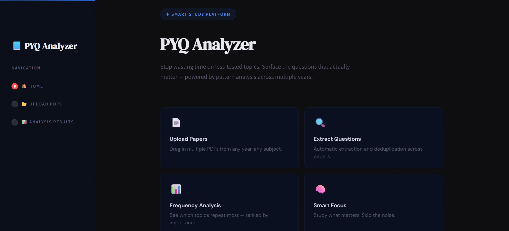
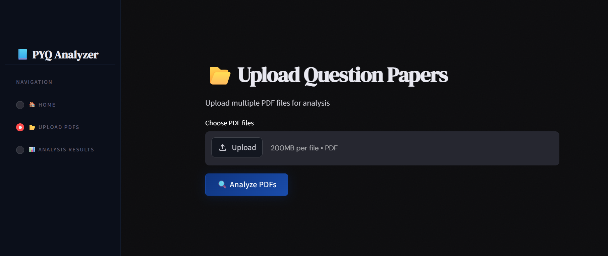
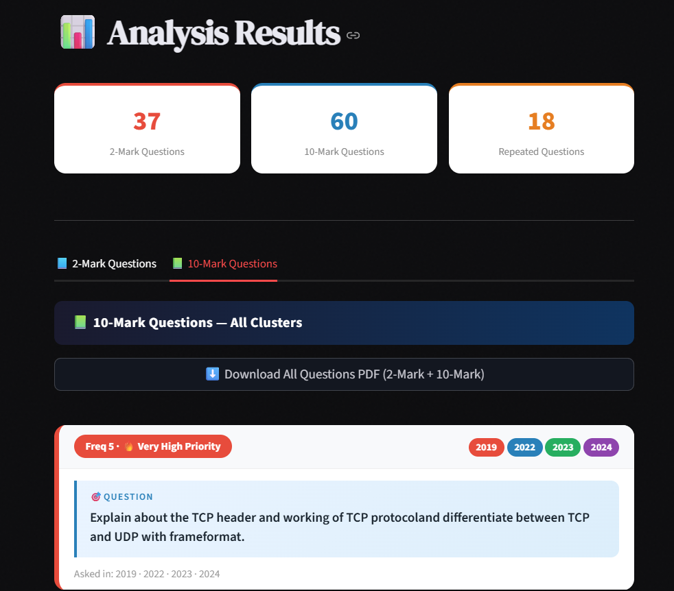

# 📘 PYQ Analyzer

> Repeated questions are gold in university exams — but finding them manually across years of papers takes hours. PYQ Analyzer does it in seconds, giving you the insights you need to study smarter and score higher.

---

## 🧠 What It Does

PYQ Analyzer is a **Streamlit web app** that takes multiple years of university exam PDFs (Previous Year Question Papers), extracts all questions, clusters semantically similar ones, and ranks them by frequency — so students know exactly what to study.

It handles the full pipeline automatically:

- 📄 **PDF Ingestion** — Upload any number of question paper PDFs
- 🔍 **Text Extraction** — Pulls raw text from every page using PyMuPDF
- 🧩 **Question Parsing** — Separates 2-mark (Section A) and 10-mark (Section B/C) questions using regex-based parsing
- 🤖 **Semantic Clustering** — Groups similar questions across years using sentence-transformers + scikit-learn
- 📊 **Frequency Analysis** — Ranks clusters by how many times a topic has appeared
- 📥 **PDF Export** — Download a clean, ranked study sheet with all questions

---

## 🔄 Workflow

```
Upload PDFs
    │
    ▼
extractor.py   →   output.json         (raw text per PDF)
    │
    ▼
parsing.py     →   parsed_questions.json   (structured questions with year/type)
    │
    ▼
analysis.py    →   clustered_questions.json  (clusters + frequency scores)
    │
    ▼
main.py        →   Streamlit UI (results + PDF download)
```

Each stage is triggered automatically when you click **"Analyze PDFs"** in the app.

---

## 🖥️ Screenshots

### Home Page

> Features overview with smart study platform branding and a "Get Started" CTA.

### Upload Page

> Multi-file PDF uploader — drag and drop multiple question papers at once.

### Analysis Results

> Clustered questions shown as cards ranked by frequency with year tags and priority badges.

---

## 🔑 Demo Credentials

| Field    | Value  |
|----------|--------|
| Username | `demo` |
| Password | `pass123` |

> ⚠️ The demo login clears any previously uploaded PDFs from the `Upload/` folder on sign-in.

---

## 🚀 Running Locally

### 1. Clone the Repository

```bash
git clone https://github.com/your-username/pyq-analyzer.git
cd pyq-analyzer
```

### 2. Create a Virtual Environment

```bash
python -m venv venv

# On macOS/Linux
source venv/bin/activate

# On Windows
venv\Scripts\activate
```

### 3. Install Dependencies

```bash
pip install -r requirements.txt
```

> **Note:** This installs PyMuPDF, sentence-transformers, scikit-learn, streamlit, reportlab, and other packages. First install may take a few minutes as it downloads ML models.

### 4. Run the App

```bash
streamlit run main.py
```

The app will open at **http://localhost:8501** in your browser.

---

## 📁 Project Structure

```
PYQ_ANALYZER_PROJECT/
│
├── main.py                    # Streamlit UI — login, upload, results pages
├── extractor.py               # PDF → raw text (PyMuPDF)
├── parsing.py                 # Raw text → structured questions (regex)
├── analysis.py                # Questions → semantic clusters (transformers)
│
├── output.json                # Intermediate: extracted text per PDF
├── parsed_questions.json      # Intermediate: structured Q&A list
├── clustered_questions.json   # Final: clusters with frequency scores
│
├── requirements.txt           # Python dependencies
└── Upload/                    # Folder where uploaded PDFs are saved
    └── *.pdf
```

---

## 📦 Key Dependencies

| Package | Purpose |
|---|---|
| `streamlit` | Web UI framework |
| `PyMuPDF` (fitz) | PDF text extraction |
| `sentence-transformers` | Semantic question embeddings |
| `scikit-learn` | Clustering (KMeans / agglomerative) |
| `reportlab` | PDF export of study sheets |
| `numpy`, `scipy` | Numerical / similarity calculations |

---

## 📊 Understanding the Results

Each question cluster card shows:

- 🎯 **Canonical Question** — the best representative phrasing of the cluster
- **Frequency badge** — how many times this topic appeared across all papers
- **Year pills** — color-coded by year (2019, 2022, 2023, 2024)
- **Priority label:**
  - 🔥 `Very High Priority` — appeared 4+ times
  - ⚡ `High Priority` — appeared 3 times
  - 📌 `Repeated` — appeared 2 times
  - Gray — unique question

Results are split into two tabs: **2-Mark Questions** and **10-Mark Questions**.

---

## 📥 Exporting Results

Click **"⬇️ Download All Questions PDF"** in either tab to get a clean A4 PDF containing all clustered questions sorted by frequency — ready to print or share.

---

## 🛡️ Notes

- All processing happens **locally** — no data leaves your machine
- The `Upload/` folder is cleared on each new login to keep things fresh
- For best results, upload at least 3–4 years of papers for meaningful frequency analysis

---

# Author

Akhil Garg

---

# License

This project is for educational and learning purposes.
